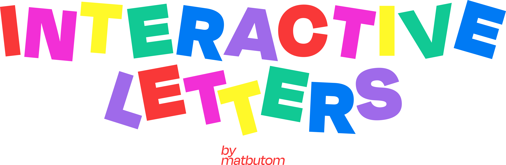

# Interactive Letters

[]

Una colección de experimentos interactivos con letras generativas, impulsados por la creatividad y la tecnología. Este repositorio contiene varias obras que exploran diferentes formas de interactuar con tipografía a través del movimiento, la cámara web y la física.

## Obras Incluidas

* **[Nombre de la Obra 1]**: [Breve descripción de la obra 1. Puedes mencionar la tecnología principal o la interacción clave.]
* **[Nombre de la Obra 2]**: [Breve descripción de la obra 2.]
* **[Nombre de la Obra 3]**: [Breve descripción de la obra 3.]
* ... (Añade más obras según sea necesario)

## Demo en Vivo

Puedes experimentar estas obras en vivo aquí:

[Enlace a tu página de GitHub Pages o donde tengas desplegado el proyecto]

## Tecnologías Utilizadas

* [Mechanic](https://mechanic.design/): Framework para diseño generativo.
* [p5.js](https://p5js.org/): Librería de JavaScript para crear gráficos interactivos.
* [Matter.js](https://brm.io/matter-js/): Motor de física 2D (utilizado en algunas obras).
* [handtrack.js](https://github.com/tensorflow/tfjs-models/tree/master/handtrack): Modelo de detección de manos (utilizado en algunas obras).
* [JavaScript](https://developer.mozilla.org/en-US/docs/Web/JavaScript): Lenguaje de programación principal.
* [HTML](https://developer.mozilla.org/en-US/docs/Web/HTML): Estructura de la página web.
* [CSS](https://developer.mozilla.org/en-US/docs/Web/CSS): Estilos visuales.

## Cómo Explorar

1.  **Clona el repositorio:**
    ```bash
    git clone [https://github.com/delulu?tab=repositories]
    cd [nombre del repositorio]
    ```
2.  **Instala las dependencias (si es necesario):**
    ```bash
    npm install
    # o
    yarn add
    ```
3.  **Ejecuta Mechanic para ver las obras localmente:**
    ```bash
    npx mechanic dev
    # o
    yarn mechanic dev
    ```
    Esto abrirá un servidor local donde podrás ver y experimentar con las diferentes obras.

## Personalización

Si deseas modificar o crear tus propias obras, puedes explorar la estructura del proyecto:

* **`functions/`**: Contiene las carpetas de cada obra. Dentro de cada carpeta, el archivo `index.js` define la lógica y la configuración de la obra.
* **`static/`**: Almacena archivos estáticos como imágenes (incluyendo el logo) y otros assets.
* **`app/`**: Contiene la personalización de la interfaz de Mechanic (como la barra lateral).

## Despliegue en GitHub Pages

Para desplegar tu proyecto en GitHub Pages y compartirlo en línea:

1.  **Asegúrate de que tu proyecto esté en un repositorio público en GitHub.**
2.  **Configura GitHub Pages:** Ve a la página de tu repositorio en GitHub, luego a "Settings" -> "Pages".
3.  **Selecciona la rama desde donde quieres desplegar (normalmente `main` o `gh-pages`).**
4.  **Elige la carpeta "root" como la fuente.**
5.  **Guarda la configuración.** GitHub Pages generará una URL para tu proyecto en unos minutos
